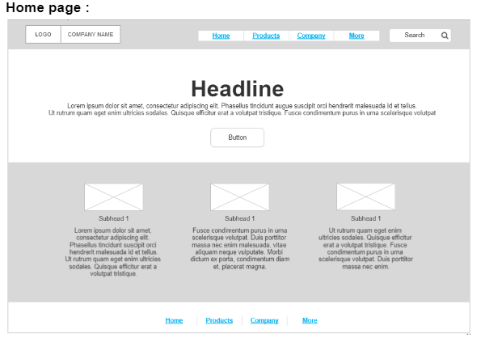
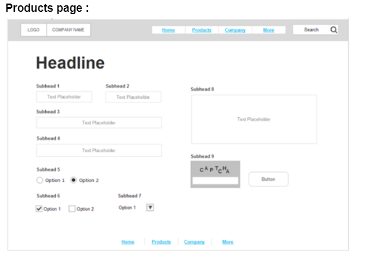
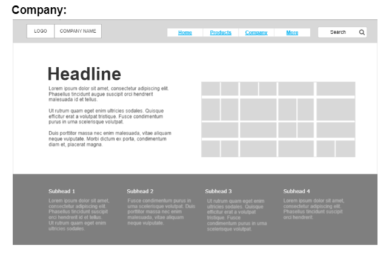
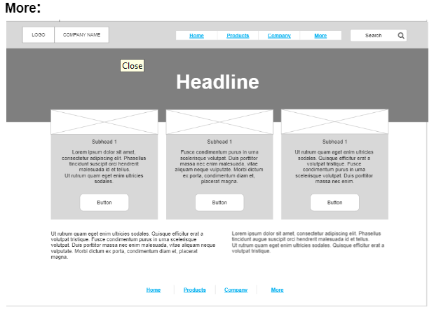

# wireframe2website

## What is this project ?
convert wireframe design to website by HTML language
## what are the tools you used to create it ?
* HTML
* https://placehold.jp/en.html (images from this website)
* VS Code 

 ## 1. Home Page Image : 

 ## 2. Products Page :

 ## 3. Company Page :

 ## 4. More Page :

